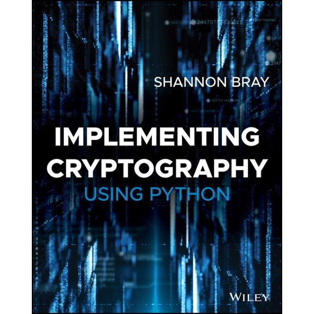

# Cryptography Implementation in Python

Personal learning note about the implementation of cryptography in Python.

Book referenced: [Shannon W. Bray, Implementing Cryptography Using Python](https://www.amazon.com/Implementing-Cryptography-Using-Python-Shannon/dp/1119612209)

